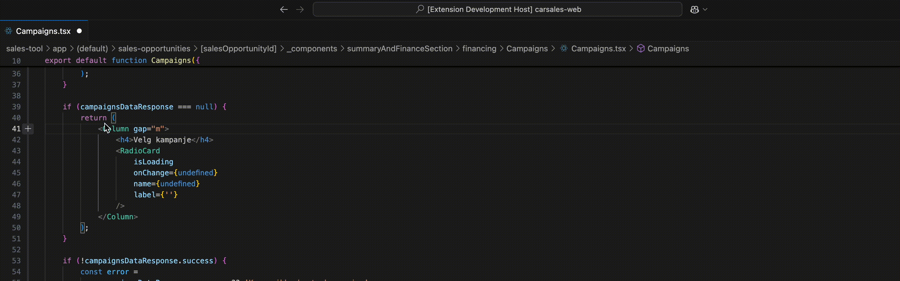

# Wrapper Extension

The Wrapper extension for Visual Studio Code provides commands to wrap selected text in various HTML elements such as `div`, `span`, `container`, `row`, `column`, and `fragment`. It also includes a command to remove wrappers.

## Features

- Wrap selected text with `div`, `span`, `Row`, `column`, or `fragment`.
- Remove wrappers from selected text.
- Keybindings for quick access to wrapping commands.

## Usage

### Convert with cursor

Open a TypeScript React file in Visual Studio Code.
Select the text you want to wrap.
Use the command palette (Ctrl+Shift+P or Cmd+Shift+P on macOS) to search for the wrapping commands:

- Wrap with div
- Wrap with span
- Wrap with Row
- Wrap with Column
- Wrap with Fragment
- Remove wrapper

### Highlight selection

You can also select the text you want to wrap by highlighting it with your mouse or keyboard. Once selected, use the command palette or the keybindings to wrap the selected text with the desired HTML element.

### Shortcuts

Alternatively, use the keybindings:

- Alt+D (or Option+D on macOS) to wrap with div
- Alt+S (or Option+S on macOS) to wrap with span
- Alt+F (or Option+F on macOS) to wrap with fragment
- Alt+R (or Option+R on macOS) to remove wrapper
